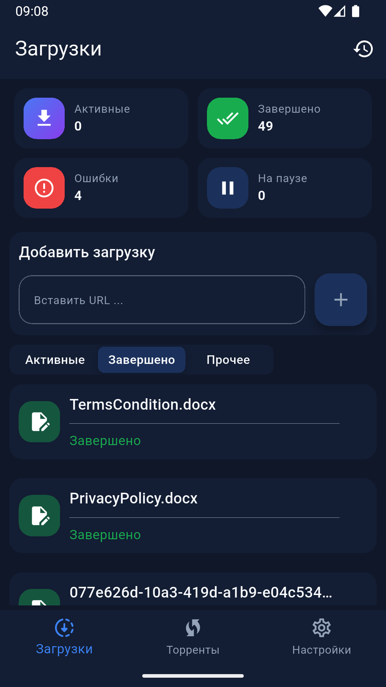

# EDM - Easy Download Manager

<p align="center">
  
</p>

<p align="center">
  A powerful, feature-rich download manager built with Flutter for Android, iOS, Web, macOS, Linux, and Windows.
</p>

<p align="center">
  <a href="https://github.com/your-username/easy_download_manager/stargazers">
    
  </a>
  <a href="https://github.com/your-username/easy_download_manager/issues">
    
  </a>
  <a href="https://github.com/your-username/easy_download_manager/blob/main/LICENSE">
    
  </a>
</p>

## 📱 Screenshots

<div style="display: flex; flex-wrap: wrap; gap: 10px; justify-content: center;">
  
  
  
  
  
  
</div>

## 🌟 Features

EDM (Easy Download Manager) is a comprehensive download manager application with the following features:

### 🔽 Download Management
- **Multi-Protocol Support**: HTTP/HTTPS and Torrent downloads
- **Foreground Service**: Ensures downloads continue even when the app is in the background
- **Download Resuming**: Automatically resume interrupted downloads
- **Progress Tracking**: Real-time download progress with speed indicators
- **Download History**: Keep track of all your downloaded files

### ⚙️ Customization & Settings
- **Dark/Light Theme**: Adaptive theme support based on system preferences
- **Multi-Language Support**: Available in multiple languages
- **Download Location**: Choose where to save your downloads
- **Custom File Names**: Rename files before downloading
- **Download Sorting**: Sort downloads by name, date, size, and status

### 📱 User Interface
- **Modern Material Design**: Clean and intuitive UI/UX
- **Responsive Layout**: Works seamlessly across all device sizes
- **Empty States**: Helpful placeholders when no downloads are present
- **Category Organization**: Organize downloads by status (Active, Paused, Completed)

### 🔔 Notifications
- **Download Completion Alerts**: Get notified when downloads finish
- **Progress Updates**: Ongoing notifications showing download progress
- **Sound Alerts**: Audible notifications for important events

## 🛠️ Technical Details

### Built With
- [Flutter](https://flutter.dev/) - Cross-platform framework
- [Dart](https://dart.dev/) - Programming language
- [Bloc/Cubit](https://bloclibrary.dev/) - State management
- [Go Router](https://pub.dev/packages/go_router) - Navigation
- [Flutter Downloader](https://pub.dev/packages/flutter_downloader) - Background downloading
- [DTorrent](https://pub.dev/packages/dtorrent_parser) - Torrent parsing and downloading
- [Shared Preferences](https://pub.dev/packages/shared_preferences) - Local data persistence

### Architecture
The app follows a clean architecture pattern with:
- **Presentation Layer**: UI components and widgets
- **Domain Layer**: Business logic and models
- **Data Layer**: Repositories and data sources

## 🚀 Getting Started

### Prerequisites
- Flutter SDK (version 3.9.2 or higher)
- Dart SDK
- Android Studio / Xcode for mobile development
- VS Code or Android Studio with Flutter extensions

### Installation

1. Clone the repository:
   ```bash
   git clone https://github.com/your-username/easy_download_manager.git
   ```

2. Navigate to the project directory:
   ```bash
   cd easy_download_manager
   ```

3. Install dependencies:
   ```bash
   flutter pub get
   ```

4. Run the app:
   ```bash
   flutter run
   ```

## 📦 Supported Platforms

| Platform | Status |
|----------|--------|
| Android  | ✅ Supported |
| iOS      | ✅ Supported |
| Web      | ✅ Supported |
| macOS    | ✅ Supported |
| Linux    | ✅ Supported |
| Windows  | ✅ Supported |

## 🌍 Localization

EDM supports multiple languages:
- English
- French
- German
- Italian
- Spanish
- Russian
- Ukrainian
- Arabic
- Vietnamese
- Chinese
- Japanese
- Korean

## 🤝 Contributing

Contributions are welcome! Here's how you can contribute:

1. Fork the repository
2. Create a feature branch (`git checkout -b feature/AmazingFeature`)
3. Commit your changes (`git commit -m 'Add some AmazingFeature'`)
4. Push to the branch (`git push origin feature/AmazingFeature`)
5. Open a Pull Request

Please make sure to follow the [code of conduct](CODE_OF_CONDUCT.md) and [contributing guidelines](CONTRIBUTING.md).

## 📄 License

This project is licensed under the MIT License - see the [LICENSE](LICENSE) file for details.

## 🙏 Acknowledgments

- Thanks to all the open-source packages that made this project possible
- Inspired by popular download managers
- Special thanks to the Flutter community

---

<p align="center">
  Made with ❤️ using Flutter
</p>
